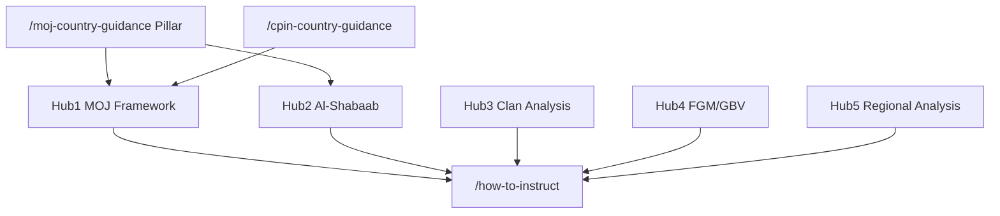
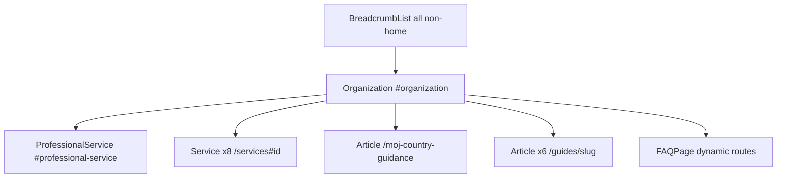

# SEO Architecture — somaliaexpert.com

**Canonical domain:** `https://www.somaliaexpert.com`  
**Site name:** SomaliaExpert  
**Locale:** `en_GB` (UK immigration solicitors, law firms, Legal Aid practitioners)

This document is the single source of truth for keyword strategy, unique content assets, content clusters, internal linking, GEO (Generative Engine Optimization), off-page SEO, schema architecture, and launch deployment for somaliaexpert.com. All slugs and URLs align with the canonical routes in `data/` and the App Router.

**Implementation status:** Implemented in codebase (June 2026). Canonical slugs, internal linking matrix (`data/related-links.ts`), GEO artifacts, schema, sitemap inventory (`lib/seo/publicUrlInventory.ts`), and 301 redirects (`lib/seo/slug-redirects.ts`, `middleware.ts`) align with this document. Run `npm run seo:verify` after SEO changes.

**Related files:** `data/asylum-profiles.ts`, `data/regions.ts`, `data/guides.ts`, `data/case-types.ts`, `data/glossary.ts`, `data/services.ts`, `data/cpin-data.ts`, `data/profile-geo.ts`, `data/related-links.ts`, `lib/metadata.ts`, `lib/schema.ts`, `lib/constants.ts`, `lib/seo/publicUrlInventory.ts`, `scripts/generate-seo.ts`, `scripts/verify-seo.ts`

---

## 1. Keyword Strategy

### Tier 1 — Transactional

**Target pages:** homepage, services, asylum profiles, qualifications, case types, contact.

| Keyword | Primary URL |
|---------|-------------|
| Somalia expert witness UK | `/`, `/what-is-a-somalia-expert-witness` |
| Somalia country expert UK | `/`, `/services` |
| Somalia asylum expert report UK | `/services`, `/how-to-instruct` |
| Somalia country report solicitor | `/services`, `/cpin-country-guidance` |
| Somalia clan expert witness UK | `/asylum-profiles/clan-minority-groups`, `/services#clan-analysis` |
| Somalia Al-Shabaab expert report | `/asylum-profiles/al-shabaab-targeting`, `/services#al-shabaab-risk` |
| Somalia FGM expert witness UK | `/asylum-profiles/fgm-gender-based-violence`, `/services#fgm-reports` |
| Somalia MOJ expert report UK | `/moj-country-guidance`, `/services#moj-framework` |
| Somalia Mogadishu expert witness | `/regions/mogadishu-return`, `/moj-country-guidance` |
| Legal Aid Somalia expert UK | `/fees`, `/guides/instructing-somalia-expert`, `/how-to-instruct` |

### Tier 2 — Informational

**Target pages:** MOJ pillar, CPIN hub, guides, asylum profiles, regions, glossary.

| Keyword | Primary URL |
|---------|-------------|
| MOJ Somalia country guidance 2014 | `/moj-country-guidance`, `/glossary#moj-and-others-2014` |
| MOJ framework Somalia returns | `/moj-country-guidance`, `/guides/moj-framework-guide` |
| Somalia Al-Shabaab 2025 2026 update | `/guides/al-shabaab-asylum-guide`, `/asylum-profiles/al-shabaab-targeting`, `/moj-country-guidance` |
| Somalia clan minority asylum UK | `/asylum-profiles/clan-minority-groups`, `/case-types/clan-minority-asylum` |
| Somalia ATMIS withdrawal asylum | `/moj-country-guidance`, `/glossary#atmis`, `/cpin-country-guidance` |
| Somaliland expert witness UK | `/regions/somaliland`, `/case-types/somaliland-asylum` |
| Puntland asylum expert UK | `/regions/puntland`, `/guides/somaliland-puntland-guide` |
| Somalia FGM asylum prevalence | `/asylum-profiles/fgm-gender-based-violence`, `/guides/fgm-somalia-guide` |
| Somalia return risk 2026 | `/regions/mogadishu-return`, `/asylum-profiles/failed-asylum-seekers-return` |
| EUAA Somalia country guidance 2025 | `/cpin-country-guidance`, `/glossary#euaa-country-guidance` |

### Tier 3 — Long-tail

**Target pages:** asylum profiles, guides, case types, regions, fees, qualifications.

| Keyword | Primary URL(s) |
|---------|----------------|
| Somalia clan minority Benadiri expert witness UK | `/asylum-profiles/clan-minority-groups`, `/glossary#benadiri`, `/case-types/clan-minority-asylum` |
| Al-Shabaab forced recruitment asylum expert UK | `/asylum-profiles/forced-recruitment-conscription`, `/guides/al-shabaab-asylum-guide` |
| MOJ diaspora test Somalia expert witness | `/moj-country-guidance`, `/asylum-profiles/diaspora-without-clan-support`, `/guides/moj-framework-guide` |
| Somalia Somaliland asylum expert report UK | `/regions/somaliland`, `/case-types/somaliland-asylum`, `/guides/somaliland-puntland-guide` |
| South central Somalia article 15c expert | `/case-types/article-15c-south-central`, `/regions/south-central-somalia` |
| Somalia FGM daughter at risk expert UK | `/asylum-profiles/fgm-gender-based-violence`, `/case-types/fgm-somalia-asylum` |
| Mogadishu return clan support expert report | `/regions/mogadishu-return`, `/moj-country-guidance`, `/asylum-profiles/failed-asylum-seekers-return` |
| Somalia CPIN challenge expert witness UK | `/cpin-country-guidance`, `/services#cpin-challenge`, `/case-types/upper-tribunal-somalia` |
| ATMIS withdrawal Somalia asylum expert | `/glossary#atmis`, `/moj-country-guidance`, `/cpin-country-guidance` |
| Somalia OA 2022 country guidance expert | `/cpin-country-guidance`, `/glossary#oa-and-others-2022`, `/case-types/fresh-claims-somalia` |

### Keyword → URL implementation reference

| Cluster | URL pattern | Meta source |
|---------|-------------|-------------|
| Brand / transactional | `/` | Page-level `createMetadata()` |
| Asylum profile transactional | `/asylum-profiles/{slug}` | `metaTitle`, `metaDescription`, `h1` in `data/asylum-profiles.ts` |
| MOJ pillar / informational | `/moj-country-guidance` | Page-level metadata + section anchors |
| CPIN pillar / informational | `/cpin-country-guidance` | Page-level metadata + `data/cpin-data.ts` |
| Regional informational | `/regions/{slug}` | `data/regions.ts` |
| Case-type transactional | `/case-types/{slug}` | `data/case-types.ts` |
| Informational guides | `/guides/{slug}` | `data/guides.ts` |
| Utility / process | `/how-to-instruct`, `/fees`, `/qualifications`, `/faq` | Page-level metadata |
| Services | `/services`, `/services#{id}` | `data/services.ts` |

---

## 2. Unique Content Assets

Five competitive differentiators that distinguish somaliaexpert.com from generic country-expert directories.

| # | Asset | URL(s) | Status |
|---|-------|--------|--------|
| 1 | MOJ framework pillar — most comprehensive MOJ framework guide in the market | `/moj-country-guidance` | **Live** — `mojFrameworkTable` from `data/cpin-data.ts` |
| 2 | Regional structure — Mogadishu, Somaliland, Puntland, South/Central | `/regions`, `/regions/mogadishu-return`, `/regions/somaliland`, `/regions/puntland`, `/regions/south-central-somalia` | **Live** |
| 3 | Al-Shabaab 2025–2026 offensive content | `/moj-country-guidance`, `/guides/al-shabaab-asylum-guide`, `/asylum-profiles/al-shabaab-targeting`, `/regions/south-central-somalia` | **Live** — extend GEO blocks in `data/profile-geo.ts` |
| 4 | ATMIS withdrawal analysis | `/moj-country-guidance`, `/glossary#atmis`, `/cpin-country-guidance` | Partial — glossary term live; deepen MOJ update columns |
| 5 | Clan minority vulnerability analysis | `/asylum-profiles/clan-minority-groups`, `/case-types/clan-minority-asylum`, `/guides/clan-structure-somalia-guide` | **Live** — GEO highlight block in `data/profile-geo.ts` |

---

## 3. Content Clusters

Five topical hubs drive internal linking, anchor text, and content depth. Hub 1 (MOJ Framework) and `/cpin-country-guidance` connect all profile, region, and case-type spokes.



### Brief slug → canonical slug mapping

Document shorthand URLs from briefs; canonical routes are what the codebase serves.

| Brief / shorthand | Canonical route |
|-------------------|-----------------|
| `/asylum-profiles/failed-asylum-seekers` | `/asylum-profiles/failed-asylum-seekers-return` |
| `/asylum-profiles/diaspora-no-clan` | `/asylum-profiles/diaspora-without-clan-support` |
| `/asylum-profiles/forced-recruitment` | `/asylum-profiles/forced-recruitment-conscription` |
| `/asylum-profiles/fgm-gbv` | `/asylum-profiles/fgm-gender-based-violence` |
| `/guides/clan-structure-guide` | `/guides/clan-structure-somalia-guide` |
| `/case-types/fgm-somalia` | `/case-types/fgm-somalia-asylum` |
| `/glossary#moj` | `/glossary#moj-and-others-2014` |

### Hub 1: MOJ Framework

| Role | URL |
|------|-----|
| Pillar | `/moj-country-guidance` |
| Guide | `/guides/moj-framework-guide` |
| Profile | `/asylum-profiles/failed-asylum-seekers-return` |
| Profile | `/asylum-profiles/diaspora-without-clan-support` |
| Region | `/regions/mogadishu-return` |
| Glossary | `/glossary#moj-and-others-2014` |

### Hub 2: Al-Shabaab

| Role | URL |
|------|-----|
| Profile | `/asylum-profiles/al-shabaab-targeting` |
| Profile | `/asylum-profiles/forced-recruitment-conscription` |
| Guide | `/guides/al-shabaab-asylum-guide` |
| Region | `/regions/south-central-somalia` |
| MOJ section | `/moj-country-guidance` (Al-Shabaab findings) |
| Case type | `/case-types/article-15c-south-central` |

### Hub 3: Clan Analysis

| Role | URL |
|------|-----|
| Profile | `/asylum-profiles/clan-minority-groups` |
| Guide | `/guides/clan-structure-somalia-guide` |
| Case type | `/case-types/clan-minority-asylum` |
| Glossary | `/glossary#clan`, `/glossary#benadiri`, `/glossary#gaboye-madhiban`, `/glossary#gosha`, `/glossary#bantu` |
| Regions | `/regions/mogadishu-return`, `/regions/somaliland`, `/regions/puntland`, `/regions/south-central-somalia` |

### Hub 4: FGM/GBV

| Role | URL |
|------|-----|
| Profile | `/asylum-profiles/fgm-gender-based-violence` |
| Profile | `/asylum-profiles/women-discriminatory-practices` |
| Guide | `/guides/fgm-somalia-guide` |
| Case type | `/case-types/fgm-somalia-asylum` |
| Glossary | `/glossary#fgm`, `/glossary#amm-and-others-2011` |

### Hub 5: Regional Analysis

| Role | URL |
|------|-----|
| Hub | `/regions` |
| Region | `/regions/somaliland` |
| Region | `/regions/puntland` |
| Region | `/regions/mogadishu-return` |
| Region | `/regions/south-central-somalia` |
| Guide | `/guides/somaliland-puntland-guide` |
| Case type | `/case-types/somaliland-asylum` |

### Slug inventory

**Asylum profiles (8):**

`clan-minority-groups`, `al-shabaab-targeting`, `fgm-gender-based-violence`, `failed-asylum-seekers-return`, `diaspora-without-clan-support`, `former-government-officials`, `women-discriminatory-practices`, `forced-recruitment-conscription`

**Regions (4):**

`mogadishu-return`, `somaliland`, `puntland`, `south-central-somalia`

**Guides (6):**

`moj-framework-guide`, `clan-structure-somalia-guide`, `al-shabaab-asylum-guide`, `somaliland-puntland-guide`, `fgm-somalia-guide`, `instructing-somalia-expert`

**Case types (8):**

`ftt-asylum-appeal-somalia`, `upper-tribunal-somalia`, `article-15c-south-central`, `deportation-removal-somalia`, `fresh-claims-somalia`, `fgm-somalia-asylum`, `somaliland-asylum`, `clan-minority-asylum`

**Services (8 IDs):**

`country-condition-reports`, `clan-analysis`, `al-shabaab-risk`, `fgm-reports`, `internal-relocation`, `moj-framework`, `cpin-challenge`, `oral-evidence`

### Glossary anchor ID convention

Glossary terms use `slug` from `data/glossary.ts` as the fragment ID (e.g. `#moj-and-others-2014`, `#atmis`, `#benadiri`).

**SEO-critical anchor mappings:**

| Cluster reference | Glossary term | Canonical anchor ID |
|-------------------|---------------|---------------------|
| `#moj` | MOJ and Others [2014] | `moj-and-others-2014` |
| `#oa` | OA and Others [2022] | `oa-and-others-2022` |
| `#amm` | AMM and Others [2011] | `amm-and-others-2011` |
| `#atmis` | ATMIS | `atmis` |
| `#al-shabaab` | Al-Shabaab | `al-shabaab` |
| `#article-15c` | Article 15(c) | `article-15c` |
| `#clan` | Clan | `clan` |
| `#benadiri` | Benadiri | `benadiri` |
| `#fgm` | FGM | `fgm` |
| `#euaa` | EUAA Country Guidance | `euaa-country-guidance` |
| `#cpin` | CPIN | `cpin` |

---

## 4. GEO Optimization Targets

Content structured for AI citation and featured snippets: definition-first, tables, numbered steps, citeable statistics.

| # | GEO target | URL | Required extractable artifact | Implementation |
|---|------------|-----|------------------------------|----------------|
| 1 | MOJ framework table | `/moj-country-guidance` | Issue / MOJ Finding / 2025-2026 Update table | **Live** — `mojFrameworkTable` in `data/cpin-data.ts` |
| 2 | Current Somalia CPINs table | `/cpin-country-guidance` | CPIN quick-reference table (title, date, key issue) | **Live** — `currentCpins` in `data/cpin-data.ts` |
| 3 | Al-Shabaab renewed offensive | `/guides/al-shabaab-asylum-guide`, `/asylum-profiles/al-shabaab-targeting` | Definition-first summary + dated 2025-2026 context | Partial — extend `data/profile-geo.ts` |
| 4 | ATMIS withdrawal impact | `/moj-country-guidance`, `/glossary#atmis` | Citeable summary paragraph + timeline | Content target — glossary term exists |
| 5 | Clan minority vulnerability | `/asylum-profiles/clan-minority-groups` | Risk factors table / numbered list | Partial — GEO highlight block exists |
| 6 | Somalia return risk 2026 | `/regions/mogadishu-return`, `/asylum-profiles/failed-asylum-seekers-return` | Return viability checklist | Content target |

**GEO content rules:**

- Lead with a direct answer paragraph (40–60 words) before depth.
- Tables use `<table>` with `<caption>` and header row for accessibility and parsing.
- Include source citations (OSCOLA-style) where statistics, CPIN positions, or country guidance are cited.
- Avoid gating key factual content behind accordions only.

**MOJ framework table (GEO #1) — required rows (from `mojFrameworkTable`):**

| Issue | MOJ Finding | 2025-2026 Update |
|-------|-------------|------------------|
| Mogadishu return: ordinary civilian | Generally no Article 3 risk for those with no particular profile | Al-Shabaab offensive renewal undermines this in some areas |
| Clan support in Mogadishu | Essential for viable return: diaspora financial support needed if no clan present | Continues to apply |
| Al-Shabaab forced recruitment | No real risk for ordinary Mogadishu civilians | Disputed: recruitment pressure outside Mogadishu high |
| Former government officials | Individual risk beyond general finding | July 2025 CPIN confirms targeting risk |
| ATMIS withdrawal | Not addressed in MOJ | Reduced AU force presence; security implications for return |

**Current Somalia CPINs table (GEO #2) — required rows (from `currentCpins`):**

| CPIN Topic | Version/Date | Key Issue |
|-----------|-------------|-----------|
| Mogadishu: Al-Shabaab & Security | July 2025 | State willing but unable to protect |
| Humanitarian Situation in Mogadishu | July 2025 | Overcrowding, IDPs, access to services |
| Women Fearing GBV | Updated | FGM, forced marriage, domestic violence |
| EUAA Country Guidance | October 2025 | Actors of protection chapter updated |

---

## 5. Off-Page SEO Targets

### Directories (listing submissions)

| Directory | URL | Target page to link |
|-----------|-----|---------------------|
| Electronic Immigration Network (EIN) | [ein.org.uk/experts](https://ein.org.uk/experts) | `/`, `/asylum-profiles/*`, `/qualifications` |
| ILPA membership directory | ILPA member directory | `/qualifications`, `/guides/*` |
| Free Movement | [freemovement.org.uk](https://freemovement.org.uk) | `/moj-country-guidance`, `/cpin-country-guidance`, `/guides/*` |
| UNHCR UK | [unhcr.org/uk](https://www.unhcr.org/uk/) | `/moj-country-guidance`, country-condition content |
| Refugee Action | [refugee-action.org.uk](https://www.refugee-action.org.uk/) | `/fees`, `/how-to-instruct` (Legal Aid angle) |

**Submission tracking template:**

| Directory | Owner | Submitted | Live URL | Referral sessions/mo |
|-----------|-------|-----------|----------|----------------------|
| EIN | | | | |
| ILPA | | | | |
| Free Movement | | | | |
| UNHCR UK | | | | |
| Refugee Action | | | | |

### Publications (citations / guest content)

| Publication | Focus |
|-------------|-------|
| Free Movement | freemovement.org.uk — asylum, country guidance, MOJ framework, CPIN challenges |
| ILPA | Immigration practitioners, tribunal practice |
| Legal Action Group (LAG) | Legal aid, tribunal practice |
| UK Human Rights Blog | Human rights, country conditions |

**Outreach KPI template:**

| Publication | Piece title | Published | Backlink URL | Domain rating |
|-------------|-------------|-----------|--------------|---------------|
| | | | | |

### Digital PR angles

1. **MOJ Framework and Somalia Return Risk 2026** — supports `/moj-country-guidance` and GEO #1, #6.
2. **Al-Shabaab 2025–2026 Offensive and Article 15(c) Claims** — Hub 2, `/asylum-profiles/al-shabaab-targeting`, `/case-types/article-15c-south-central`.
3. **ATMIS Withdrawal and UK Asylum Implications** — GEO #4, `/glossary#atmis`, `/moj-country-guidance`.
4. **Clan Minority and Benadiri Vulnerability on Return to Mogadishu** — Hub 3, `/asylum-profiles/clan-minority-groups`.
5. **Legal Aid Instruction of Somalia Country Experts: A Solicitor's Checklist** — `/guides/instructing-somalia-expert`, `/fees`.

---

## 6. Deployment Checklist

| Task | Implementation | Status |
|------|----------------|--------|
| Vercel deployment | Connect repo; production branch deploy. Repo currently has Netlify config (`netlify.toml`) — choose host before go-live | Pending |
| DNS: apex → www | `middleware.ts` 301 redirect + registrar `www` CNAME to hosting provider | Code ready |
| `NEXT_PUBLIC_SITE_URL` | `https://www.somaliaexpert.com` in `.env.example`, `lib/constants.ts` | Ready |
| `GOOGLE_SITE_VERIFICATION` | `metadata.verification.google` in `app/layout.tsx` | Env-dependent |
| `BING_SITE_VERIFICATION` | `metadata.other` in `app/layout.tsx` | Env-dependent |
| `NEXT_PUBLIC_GA_MEASUREMENT_ID` | Analytics component (consent-gated) | Env-dependent |
| Optional analytics | `NEXT_PUBLIC_GTM_ID`, `NEXT_PUBLIC_META_PIXEL_ID`, `NEXT_PUBLIC_LINKEDIN_PARTNER_ID`, `NEXT_PUBLIC_HOTJAR_ID` | Env-dependent |
| Lead capture (Google Sheets) | `GOOGLE_SERVICE_ACCOUNT_EMAIL`, `GOOGLE_PRIVATE_KEY`, `GOOGLE_SHEET_ID`, `GOOGLE_SHEET_TAB_NAME` | Env-dependent |
| Lead webhook | `Lead_notification_url` / `LEAD_NOTIFICATION_URL` | Env-dependent |
| `html lang="en-GB"` | Root layout `<html lang="en-GB">` | **Done** |
| `hreflang` | `en-GB`, `en-US`, `x-default` in `alternates.languages` | **Done** |
| Submit sitemap | GSC + Bing Webmaster — `https://www.somaliaexpert.com/sitemap.xml` | Post-deploy |
| LinkedIn company page | `SomaliaExpertWitness` → `sameAs` in Organization schema (`lib/constants.ts`) | **Done** |
| EIN directory submission | ein.org.uk/experts | Manual post-launch |

**Canonical and robots:**

- All pages: canonical via `createMetadata()` in `lib/metadata.ts`
- Staging/preview: `noindex: true` on non-production hosts
- Production: `public/robots.txt` allow `/`, point to sitemap (generated by `npm run seo:generate`)
- Exclude from sitemap: `/contact`, `/thank-you`, `/privacy`, `/terms`
- Robots disallow: `/thank-you`, `/api/`

---

## Appendix A: Full URL Inventory (~46 routes)

### Static and hub pages (17)

| URL | Sitemap priority |
|-----|------------------|
| `/` | 1.0 |
| `/moj-country-guidance` | 0.95 |
| `/asylum-profiles` | 0.93 |
| `/regions` | 0.93 |
| `/cpin-country-guidance` | 0.90 |
| `/services` | 0.90 |
| `/what-is-a-somalia-expert-witness` | 0.90 |
| `/case-types` | 0.88 |
| `/how-to-instruct` | 0.88 |
| `/qualifications` | 0.88 |
| `/guides` | 0.87 |
| `/fees` | 0.87 |
| `/faq` | 0.87 |
| `/glossary` | 0.75 |
| `/experts` | 0.75 |
| `/cookie-policy` | 0.50 |
| `/contact` | 0.6 (excluded from sitemap) |
| `/thank-you` | noindex |

### Dynamic pages (26)

| Pattern | Count | Sitemap priority |
|---------|-------|------------------|
| `/asylum-profiles/{slug}` | 8 | 0.92 |
| `/regions/{slug}` | 4 | 0.92 |
| `/case-types/{slug}` | 8 | 0.88 |
| `/guides/{slug}` | 6 | 0.82 |

### Legal / utility (noindex)

| URL | Robots |
|-----|--------|
| `/privacy` | noindex, follow |
| `/terms` | noindex, follow |
| `/thank-you` | noindex, nofollow |

**Total indexable URLs:** ~46 (excluding `/contact`, `/thank-you`, `/privacy`, `/terms`).

---

## Appendix B: Sitemap Priorities

| Route family | Priority |
|--------------|----------|
| `/` | 1.0 |
| `/moj-country-guidance` | 0.95 |
| `/asylum-profiles` (hub), `/regions` (hub) | 0.93 |
| `/asylum-profiles/[slug]`, `/regions/[slug]` | 0.92 |
| `/cpin-country-guidance`, `/services`, `/what-is-a-somalia-expert-witness` | 0.90 |
| `/case-types` (hub), `/case-types/[slug]` | 0.88 |
| `/how-to-instruct`, `/qualifications` | 0.88 |
| `/fees`, `/faq`, `/guides` (hub) | 0.87 |
| `/guides/[slug]` | 0.82 |
| `/glossary`, `/experts` | 0.75 |
| `/cookie-policy` | 0.50 |

---

## Appendix C: Internal Linking Rules

### Rule A — Every `/asylum-profiles/[slug]` must link to:

- `/moj-country-guidance` or `/cpin-country-guidance` (relevant section)
- Relevant `/case-types/[slug]` page(s)
- Relevant `/guides/[slug]` page(s)
- Relevant `/regions/[slug]` page(s) where applicable
- `/how-to-instruct`
- `/contact`

### Rule B — Every `/guides/[slug]` must link to:

- Relevant `/asylum-profiles/[slug]` page(s)
- `/moj-country-guidance` or `/cpin-country-guidance`
- `/how-to-instruct`
- `/contact`

### Additional recommended rules

#### Every `/regions/[slug]` must link to:

- `/moj-country-guidance` or relevant guide
- Relevant `/asylum-profiles/[slug]` page(s)
- Relevant `/case-types/[slug]` page(s)
- `/how-to-instruct`
- `/contact`

#### Every `/case-types/[slug]` must link to:

- Relevant `/asylum-profiles/[slug]` page(s)
- `/how-to-instruct`
- `/contact`

#### `/moj-country-guidance` must link to:

- All 8 `/asylum-profiles/[slug]` pages
- All 6 `/guides/[slug]` pages
- All 4 `/regions/[slug]` pages
- `/how-to-instruct`
- `/contact`

#### Homepage must link to:

- Top transactional profiles: clan minority, Al-Shabaab, FGM, failed asylum seekers
- `/moj-country-guidance`
- `/regions` hub
- `/asylum-profiles` hub
- `/guides` hub
- `/how-to-instruct`
- `/contact`

#### Glossary terms must link to:

- Most relevant `/asylum-profiles/[slug]`
- Most relevant `/guides/[slug]`
- `/moj-country-guidance` or `/cpin-country-guidance` where applicable

### Enforcement

Implemented via `data/related-links.ts` and the shared `RelatedLinks` component. Breadcrumbs on all non-home pages via `PageShell`.

---

## Appendix D: Profile Minimum Links Matrix

Minimum internal links per Rule A. Implement via `relatedLinks` in `data/related-links.ts` or page template.

| Profile slug | MOJ/CPIN | Case types | Guides | Regions |
|--------------|----------|------------|--------|---------|
| `clan-minority-groups` | `/moj-country-guidance` | `clan-minority-asylum` | `clan-structure-somalia-guide` | `mogadishu-return` |
| `al-shabaab-targeting` | `/cpin-country-guidance` | `article-15c-south-central` | `al-shabaab-asylum-guide` | `south-central-somalia` |
| `fgm-gender-based-violence` | — | `fgm-somalia-asylum` | `fgm-somalia-guide` | — |
| `failed-asylum-seekers-return` | `/moj-country-guidance` | `deportation-removal-somalia` | — | `mogadishu-return` |
| `diaspora-without-clan-support` | — | — | `moj-framework-guide` | `mogadishu-return` |
| `former-government-officials` | `/cpin-country-guidance` | — | `al-shabaab-asylum-guide` | `mogadishu-return` |
| `women-discriminatory-practices` | — | `fgm-somalia-asylum` | `fgm-somalia-guide` | — |
| `forced-recruitment-conscription` | `/moj-country-guidance` | `article-15c-south-central` | `al-shabaab-asylum-guide` | `south-central-somalia` |

**All asylum profile pages:** `/how-to-instruct`, `/contact`

### Guide → profile links (Rule B)

| Guide slug | Required profile links |
|------------|------------------------|
| `moj-framework-guide` | `failed-asylum-seekers-return`, `diaspora-without-clan-support` |
| `clan-structure-somalia-guide` | `clan-minority-groups` |
| `al-shabaab-asylum-guide` | `al-shabaab-targeting`, `forced-recruitment-conscription` |
| `somaliland-puntland-guide` | — (links to regions) |
| `fgm-somalia-guide` | `fgm-gender-based-violence`, `women-discriminatory-practices` |
| `instructing-somalia-expert` | Top 4 transactional profiles |

---

## Appendix E: Schema Architecture Summary

### Root entity

```json
{
  "@type": "Organization",
  "@id": "https://www.somaliaexpert.com/#organization"
}
```

### Schema graph overview



### Children of Organization

| Type | Count | URL / @id | Notes |
|------|-------|-----------|-------|
| ProfessionalService | 1 | `/` — `#professional-service` | Homepage |
| Service | 8 | `/services#{id}` | See services inventory in Section 3 |
| Article | 1 | `/moj-country-guidance` | MOJ pillar |
| Article | 6 | `/guides/{slug}` | Guide pages |
| FAQPage | 24+ | All dynamic routes with FAQs | 2 FAQs minimum per profile/case type/region |
| BreadcrumbList | All non-home | Per-page | |
| WebSite | 1 | `/` | SearchAction optional |

### Page → schema template matrix

| Route | JSON-LD types |
|-------|---------------|
| `/` | Organization, ProfessionalService |
| `/services` | Organization, Service ×8 |
| `/moj-country-guidance` | Organization, Article, BreadcrumbList, FAQPage |
| `/cpin-country-guidance` | Organization, Article, BreadcrumbList, FAQPage |
| `/guides/[slug]` | Organization, Article, BreadcrumbList |
| `/asylum-profiles/[slug]` | Organization, BreadcrumbList, FAQPage |
| `/regions/[slug]` | Organization, BreadcrumbList, FAQPage |
| `/case-types/[slug]` | Organization, BreadcrumbList, FAQPage |
| `/experts` | Organization |
| `/faq` | Organization, FAQPage, BreadcrumbList |
| `/glossary` | Organization, BreadcrumbList |
| Static utility pages | Organization, BreadcrumbList |

**LinkedIn `sameAs`:** `https://www.linkedin.com/company/SomaliaExpertWitness`

---

## Appendix F: Recommended Build Order

1. Root layout (`lang="en-GB"`, hreflang), `createMetadata()`, `JsonLd`, Header/Footer
2. Data layer: `asylum-profiles.ts`, `regions.ts`, `case-types.ts`, `guides.ts`, `glossary.ts`, `services.ts`, `cpin-data.ts`
3. Dynamic routes: `/asylum-profiles/[slug]`, `/regions/[slug]`, `/case-types/[slug]`, `/guides/[slug]`
4. Static pages: `/moj-country-guidance`, `/cpin-country-guidance`, `/services`, `/how-to-instruct`, `/qualifications`, `/fees`, `/faq`, `/glossary`, `/contact`, `/experts`
5. Homepage with top profile links, MOJ pillar link, regions hub, guides hub
6. `RelatedLinks` component + Appendix D matrix
7. GEO tables on `/moj-country-guidance`, `/cpin-country-guidance`, and profile pages (Section 4)
8. `public/sitemap.xml`, `public/robots.txt` via `npm run seo:generate`, env verification tags
9. `middleware.ts` apex → www redirect
10. Post-launch: EIN and ILPA directory submissions, GSC/Bing sitemap submit

---

## Document control

| Version | Date | Notes |
|---------|------|-------|
| 1.0 | 2026-06-11 | Initial SEO architecture for somaliaexpert.com (replaces Nigeria template) |
